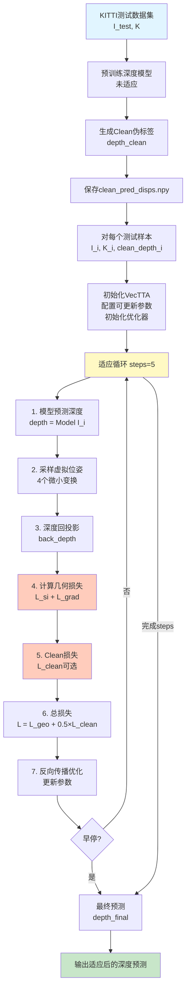
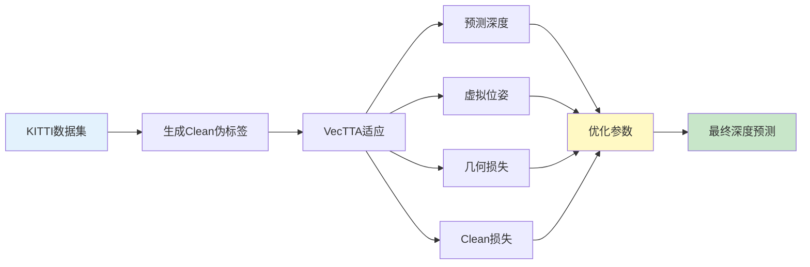

# VecTTA 论文流程图

## 一、完整系统流程图（适合论文）

### 版本1: 详细流程图（ASCII格式）

```
┌─────────────────────────────────────────────────────────────────────────┐
│                        VecTTA 完整系统流程                                │
└─────────────────────────────────────────────────────────────────────────┘

【阶段1: Clean伪标签生成】
┌─────────────────────────────────────────────────────────────────────────┐
│ 输入: KITTI测试数据集                                                    │
│   ├─ 图像: I_test [N, 3, H, W]                                          │
│   └─ 相机内参: K [N, 3, 3]                                              │
└─────────────────────────────────────────────────────────────────────────┘
                    ↓
┌─────────────────────────────────────────────────────────────────────────┐
│ 预训练深度模型 (未适应)                                                   │
│   ├─ Encoder: 特征提取                                                   │
│   └─ Decoder: 深度预测                                                   │
└─────────────────────────────────────────────────────────────────────────┘
                    ↓
┌─────────────────────────────────────────────────────────────────────────┐
│ 模型推理 (eval模式, 无梯度)                                               │
│   depth_clean = Model(I_test)  # [N, 1, H, W]                          │
└─────────────────────────────────────────────────────────────────────────┘
                    ↓
┌─────────────────────────────────────────────────────────────────────────┐
│ 保存Clean伪标签                                                          │
│   save: clean_pred_disps.npy [N, H, W]                                  │
└─────────────────────────────────────────────────────────────────────────┘
                    ↓
┌─────────────────────────────────────────────────────────────────────────┐
│ 【阶段2: 测试时适应 (VecTTA)】                                           │
│                                                                          │
│ 对每个测试样本 (I_i, K_i):                                               │
│                                                                          │
│ ┌────────────────────────────────────────────────────────────────────┐ │
│ │ 步骤1: 初始化VecTTA                                                 │ │
│ │   ├─ 加载预训练模型 (Encoder + Decoder)                             │ │
│ │   ├─ 配置可更新参数 (根据update_mode)                                │ │
│ │   │   • bn_only: 仅BatchNorm层                                      │ │
│ │   │   • bn_decoder: Decoder + 所有BN层                               │ │
│ │   │   • all: 所有参数                                               │ │
│ │   └─ 初始化优化器 (AdamW, lr=1e-4)                                   │ │
│ └────────────────────────────────────────────────────────────────────┘ │
│                          ↓                                              │
│ ┌────────────────────────────────────────────────────────────────────┐ │
│ │ 步骤2: 适应循环 (steps=5)                                           │ │
│ │                                                                   │ │
│ │   ┌─────────────────────────────────────────────────────────────┐ │ │
│ │   │ 2.1 模型预测深度                                              │ │ │
│ │   │     depth = Model(I_i)  # [1, 1, H, W]                      │ │ │
│ │   │     (训练模式，保留梯度)                                        │ │ │
│ │   └─────────────────────────────────────────────────────────────┘ │ │
│ │                          ↓                                         │ │
│ │   ┌─────────────────────────────────────────────────────────────┐ │ │
│ │   │ 2.2 采样虚拟位姿                                              │ │ │
│ │   │     poses = sample_virtual_poses()                            │ │ │
│ │   │     # 生成4个微小位姿变换:                                     │ │ │
│ │   │     # • 沿X轴平移±0.1m + 绕X轴旋转±0.05rad                    │ │ │
│ │   │     # • 沿Y轴平移±0.1m + 绕Z轴旋转±0.05rad                    │ │ │
│ │   │     # • 沿Z轴平移±0.1m + 绕X轴旋转±0.05rad                    │ │ │
│ │   └─────────────────────────────────────────────────────────────┘ │ │
│ │                          ↓                                         │ │
│ │   ┌─────────────────────────────────────────────────────────────┐ │ │
│ │   │ 2.3 计算几何一致性损失 (对每个虚拟位姿)                       │ │ │
│ │   │     for pose in poses:                                       │ │ │
│ │   │       ┌───────────────────────────────────────────────────┐ │ │ │
│ │   │       │ 深度回投影                                          │ │ │ │
│ │   │       │   back_depth = back_project(depth, K_i, pose)     │ │ │ │
│ │   │       │   # 2D深度图 → 3D点云 → 新视角2D深度图              │ │ │ │
│ │   │       └───────────────────────────────────────────────────┘ │ │ │
│ │   │                          ↓                                   │ │ │
│ │   │       ┌───────────────────────────────────────────────────┐ │ │ │
│ │   │       │ 创建可见性掩码                                      │ │ │ │
│   │       │   mask = visibility_mask(depth, back_depth)        │ │ │ │
│ │   │       │   # 过滤无效像素和边界区域                          │ │ │ │
│ │   │       └───────────────────────────────────────────────────┘ │ │ │
│ │   │                          ↓                                   │ │ │
│ │   │       ┌───────────────────────────────────────────────────┐ │ │ │
│ │   │       │ 尺度不变深度误差                                    │ │ │ │
│ │   │       │   L_si = Var(log(depth) - log(back_depth))        │ │ │ │
│ │   │       │   # 对全局尺度变化不敏感                            │ │ │ │
│ │   │       └───────────────────────────────────────────────────┘ │ │ │
│ │   │                          ↓                                   │ │ │
│ │   │       ┌───────────────────────────────────────────────────┐ │ │ │
│ │   │       │ 梯度一致性损失                                     │ │ │ │
│ │   │       │   L_grad = |∇depth - ∇back_depth|                │ │ │ │
│ │   │       │   # 保持局部几何结构                               │ │ │ │
│ │   │       └───────────────────────────────────────────────────┘ │ │ │
│ │   │                                                              │ │ │
│ │   │       L_geo = L_si + 0.5 × L_grad                          │ │ │
│ │   │                                                              │ │ │
│ │   │     L_geo_total = mean(L_geo for all poses)                │ │ │
│ │   └─────────────────────────────────────────────────────────────┘ │ │
│ │                          ↓                                         │ │
│ │   ┌─────────────────────────────────────────────────────────────┐ │ │
│ │   │ 2.4 计算Clean伪标签损失 (可选)                                 │ │ │
│ │   │     if clean_depth_i is provided:                            │ │ │
│ │   │       L_clean = L1_loss(depth, clean_depth_i)                │ │ │
│ │   │     else:                                                    │ │ │
│ │   │       L_clean = 0                                            │ │ │
│ │   └─────────────────────────────────────────────────────────────┘ │ │
│ │                          ↓                                         │ │
│ │   ┌─────────────────────────────────────────────────────────────┐ │ │
│ │   │ 2.5 总损失计算                                                │ │ │
│ │   │     L_total = L_geo_total + 0.5 × L_clean                   │ │ │
│ │   └─────────────────────────────────────────────────────────────┘ │ │
│ │                          ↓                                         │ │
│ │   ┌─────────────────────────────────────────────────────────────┐ │ │
│ │   │ 2.6 反向传播与优化                                            │ │ │
│ │   │     ∇L_total → 反向传播                                       │ │ │
│ │   │     clip_grad_norm(threshold=1.0)                            │ │ │
│ │   │     optimizer.step()  # 更新可更新参数                        │ │ │
│ │   └─────────────────────────────────────────────────────────────┘ │ │
│ │                          ↓                                         │ │
│ │   ┌─────────────────────────────────────────────────────────────┐ │ │
│ │   │ 2.7 早停检查 (可选)                                           │ │ │
│ │   │     if loss不下降 for patience=3 steps:                      │ │ │
│ │   │       break  # 提前停止                                       │ │ │
│ │   └─────────────────────────────────────────────────────────────┘ │ │
│ │                                                                   │ │
│ │   重复步骤2.1-2.7，直到完成所有steps或触发早停                    │ │
│ └────────────────────────────────────────────────────────────────────┘ │
│                          ↓                                              │
│ ┌────────────────────────────────────────────────────────────────────┐ │
│ │ 步骤3: 最终预测                                                     │ │
│ │   Model.eval()  # 切换到评估模式                                    │ │
│ │   depth_final = Model(I_i)  # [1, 1, H, W]                        │ │
│ └────────────────────────────────────────────────────────────────────┘ │
│                                                                          │
│ 输出: 适应后的深度预测 depth_final                                       │
└─────────────────────────────────────────────────────────────────────────┘
                    ↓
┌─────────────────────────────────────────────────────────────────────────┐
│ 输出: 最终深度预测                                                       │
│   depth_final [N, 1, H, W]                                              │
└─────────────────────────────────────────────────────────────────────────┘
```

---

## 二、简化版流程图（适合论文插图）

### 版本2: 模块化流程图

```
┌─────────────────────────────────────────────────────────────────────────┐
│                          输入: KITTI测试集                               │
│                    {I_i, K_i} | i = 1, 2, ..., N                       │
└─────────────────────────────────────────────────────────────────────────┘
                              ↓
        ┌─────────────────────────────────────────┐
        │  阶段1: 生成Clean伪标签 (预处理)          │
        └─────────────────────────────────────────┘
                              ↓
        ┌─────────────────────────────────────────┐
        │  预训练模型 (未适应)                      │
        │  depth_clean = Model(I_test)           │
        └─────────────────────────────────────────┘
                              ↓
        ┌─────────────────────────────────────────┐
        │  保存: clean_pred_disps.npy             │
        └─────────────────────────────────────────┘
                              ↓
┌─────────────────────────────────────────────────────────────────────────┐
│                    阶段2: VecTTA测试时适应                                │
│                                                                          │
│  对每个样本 (I_i, K_i, clean_depth_i):                                   │
│                                                                          │
│  ┌──────────────────────────────────────────────────────────────────┐   │
│  │  初始化                                                          │   │
│  │  • 加载预训练模型                                                │   │
│  │  • 配置可更新参数 (BN层/Decoder/All)                            │   │
│  │  • 初始化优化器 (AdamW)                                          │   │
│  └──────────────────────────────────────────────────────────────────┘   │
│                            ↓                                             │
│  ┌──────────────────────────────────────────────────────────────────┐   │
│  │  适应循环 (steps=5)                                              │   │
│  │                                                                  │   │
│  │  ┌──────────────┐  ┌──────────────┐  ┌──────────────┐          │   │
│  │  │ 1. 预测深度    │→ │ 2. 虚拟位姿  │→ │ 3. 几何损失  │          │   │
│  │  │ depth = Model │  │ 采样4个位姿  │  │ 回投影+一致性│          │   │
│  │  │    (I_i)      │  │              │  │             │          │   │
│  │  └──────────────┘  └──────────────┘  └──────────────┘          │   │
│  │         ↓                  ↓                  ↓                │   │
│  │  ┌──────────────────────────────────────────────────────────┐ │   │
│  │  │ 4. Clean损失 (可选)                                       │ │   │
│  │  │    L_clean = L1(depth, clean_depth_i)                     │ │   │
│  │  └──────────────────────────────────────────────────────────┘ │   │
│  │         ↓                                                      │   │
│  │  ┌──────────────────────────────────────────────────────────┐ │   │
│  │  │ 5. 总损失                                                  │ │   │
│  │  │    L = L_geo + 0.5×L_clean                                │ │   │
│  │  └──────────────────────────────────────────────────────────┘ │   │
│  │         ↓                                                      │   │
│  │  ┌──────────────────────────────────────────────────────────┐ │   │
│  │  │ 6. 优化                                                    │ │   │
│  │  │    backward() → clip_grad() → step()                    │ │   │
│  │  └──────────────────────────────────────────────────────────┘ │   │
│  │                                                                  │   │
│  │  重复直到完成steps或早停                                         │   │
│  └──────────────────────────────────────────────────────────────────┘   │
│                            ↓                                             │
│  ┌──────────────────────────────────────────────────────────────────┐   │
│  │  最终预测                                                         │   │
│  │  depth_final = Model(I_i)  (eval模式)                            │   │
│  └──────────────────────────────────────────────────────────────────┘   │
└─────────────────────────────────────────────────────────────────────────┘
                              ↓
┌─────────────────────────────────────────────────────────────────────────┐
│                        输出: 适应后的深度预测                              │
│                    {depth_final_i} | i = 1, 2, ..., N                    │
└─────────────────────────────────────────────────────────────────────────┘
```

---

## 三、Mermaid流程图（适合论文）

### 版本3: Mermaid格式



---

## 四、简化版Mermaid（最简洁）

### 版本4: 极简流程图



---

## 五、论文版详细流程图（带公式）

### 版本5: 学术论文格式

```
┌─────────────────────────────────────────────────────────────────────────┐
│                    VecTTA测试时适应流程                                    │
└─────────────────────────────────────────────────────────────────────────┘

输入: KITTI测试集 {I_i, K_i}_{i=1}^N
                    ↓
┌─────────────────────────────────────────────────────────────────────────┐
│ 阶段1: 生成Clean伪标签                                                    │
│   depth_clean = Model_0(I_test)  # 预训练模型，未适应                    │
│   保存: clean_pred_disps.npy                                            │
└─────────────────────────────────────────────────────────────────────────┘
                    ↓
┌─────────────────────────────────────────────────────────────────────────┐
│ 阶段2: VecTTA适应 (对每个样本I_i)                                        │
│                                                                          │
│  初始化:                                                                 │
│    • 加载Model_0，配置可更新参数θ_update                                  │
│    • 初始化优化器: AdamW(θ_update, lr=1e-4)                             │
│                                                                          │
│  适应循环 (t = 1, 2, ..., T, T=5):                                      │
│                                                                          │
│    1. 预测深度: d_t = Model(I_i; θ_t)                                  │
│                                                                          │
│    2. 采样虚拟位姿: P = {p_j}_{j=1}^4                                   │
│       p_j: 微小平移(±0.1m) + 旋转(±0.05rad)                             │
│                                                                          │
│    3. 几何一致性损失:                                                    │
│       L_geo = (1/4) Σ_{j=1}^4 [L_si(d_t, d_back^j) +                    │
│                                 0.5 × L_grad(d_t, d_back^j)]           │
│       where d_back^j = back_project(d_t, K_i, p_j)                     │
│                                                                          │
│       • 尺度不变损失:                                                    │
│         L_si = Var(log(d_t) - log(d_back))                             │
│                                                                          │
│       • 梯度一致性损失:                                                  │
│         L_grad = |∇d_t - ∇d_back|                                       │
│                                                                          │
│    4. Clean伪标签损失 (可选):                                            │
│       L_clean = L1(d_t, d_clean_i)                                      │
│                                                                          │
│    5. 总损失:                                                            │
│       L_total = L_geo + 0.5 × L_clean                                   │
│                                                                          │
│    6. 优化:                                                              │
│       ∇L_total → backward()                                             │
│       clip_grad_norm(θ_update, 1.0)                                     │
│       θ_{t+1} = optimizer.step(θ_t)                                     │
│                                                                          │
│    7. 早停检查: if loss不下降 for 3 steps → break                      │
│                                                                          │
│  最终预测: d_final = Model(I_i; θ_T)  (eval模式)                        │
└─────────────────────────────────────────────────────────────────────────┘
                    ↓
输出: 适应后的深度预测 {d_final_i}_{i=1}^N
```

---

## 六、关键步骤说明（论文中可用的文字描述）

### 流程概述

VecTTA的完整流程包含两个主要阶段：

**阶段1: Clean伪标签生成**
- 使用预训练的深度估计模型（未适应）在KITTI测试集上进行推理
- 将预测结果保存为clean伪标签，作为后续适应的参考

**阶段2: 测试时适应**
- 对每个测试样本，VecTTA执行以下步骤：
  1. **初始化**: 加载预训练模型，根据`update_mode`配置可更新参数（如BN层、Decoder等），初始化AdamW优化器
  2. **适应循环**: 执行T步（默认T=5）的迭代优化：
     - **深度预测**: 在当前参数下预测深度图
     - **虚拟位姿采样**: 生成4个微小的相机位姿变换（平移±0.1m，旋转±0.05rad）
     - **几何一致性损失**: 对每个虚拟位姿，通过深度回投影计算尺度不变损失和梯度一致性损失
     - **Clean伪标签损失**: 计算当前预测与clean伪标签的L1损失（可选）
     - **优化**: 反向传播总损失，梯度裁剪后更新可更新参数
     - **早停**: 如果损失连续3步不下降，提前停止
  3. **最终预测**: 在评估模式下进行最终深度预测

### 损失函数

总损失由几何一致性损失和Clean伪标签损失组成：

```
L_total = L_geo + 0.5 × L_clean
```

其中几何一致性损失为：

```
L_geo = (1/4) Σ_{j=1}^4 [L_si(d, d_back^j) + 0.5 × L_grad(d, d_back^j)]
```

- `L_si`: 尺度不变深度误差，使用对数差的方差
- `L_grad`: 梯度一致性损失，保持局部几何结构
- `L_clean`: Clean伪标签的L1损失，权重0.5

---

## 七、论文中可用的简化流程图（推荐）

### 最简洁版本（适合论文）

```
输入: KITTI测试集
    ↓
[生成Clean伪标签] → clean_pred_disps.npy
    ↓
[VecTTA适应] (对每个样本)
    ├─ 初始化: 配置可更新参数，初始化优化器
    ├─ 适应循环 (T=5步):
    │   ├─ 预测深度
    │   ├─ 采样虚拟位姿 (4个)
    │   ├─ 计算几何损失 (回投影 + 一致性)
    │   ├─ 计算Clean损失 (可选)
    │   └─ 优化参数
    └─ 最终预测
    ↓
输出: 适应后的深度预测
```

---

## 八、LaTeX格式（可直接用于论文）

```latex
\begin{algorithm}
\caption{VecTTA测试时适应流程}
\begin{algorithmic}[1]
\REQUIRE 测试图像 $I_i$，相机内参 $K_i$，Clean伪标签 $d_{clean}$ (可选)
\ENSURE 适应后的深度预测 $d_{final}$
\STATE 初始化：加载预训练模型，配置可更新参数 $\theta_{update}$，初始化优化器
\FOR{$t = 1$ to $T$ (默认$T=5$)}
    \STATE 预测深度：$d_t = \text{Model}(I_i; \theta_t)$
    \STATE 采样虚拟位姿：$\mathcal{P} = \{p_j\}_{j=1}^4$
    \STATE 计算几何损失：
    \STATE \quad $L_{geo} = \frac{1}{4}\sum_{j=1}^4 [L_{si}(d_t, d_{back}^j) + 0.5 \times L_{grad}(d_t, d_{back}^j)]$
    \STATE \quad where $d_{back}^j = \text{back\_project}(d_t, K_i, p_j)$
    \IF{clean伪标签存在}
        \STATE $L_{clean} = \text{L1}(d_t, d_{clean})$
    \ELSE
        \STATE $L_{clean} = 0$
    \ENDIF
    \STATE $L_{total} = L_{geo} + 0.5 \times L_{clean}$
    \STATE 反向传播：$\nabla L_{total} \rightarrow \text{backward}()$
    \STATE 梯度裁剪：$\text{clip\_grad\_norm}(\theta_{update}, 1.0)$
    \STATE 更新参数：$\theta_{t+1} = \text{optimizer.step}(\theta_t)$
    \IF{早停条件满足}
        \STATE \textbf{break}
    \ENDIF
\ENDFOR
\STATE 最终预测：$d_{final} = \text{Model}(I_i; \theta_T)$ (eval模式)
\RETURN $d_{final}$
\end{algorithmic}
\end{algorithm}
```

---

## 九、推荐使用的流程图

根据论文需求，推荐使用：

1. **详细流程图（版本1）**: 适合方法部分的详细说明
2. **简化版流程图（版本2）**: 适合系统架构图
3. **Mermaid流程图（版本3）**: 适合在线文档或演示
4. **LaTeX算法（版本8）**: 适合学术论文的方法部分

您可以根据论文的具体需求选择合适的版本，或告诉我需要调整的地方。


